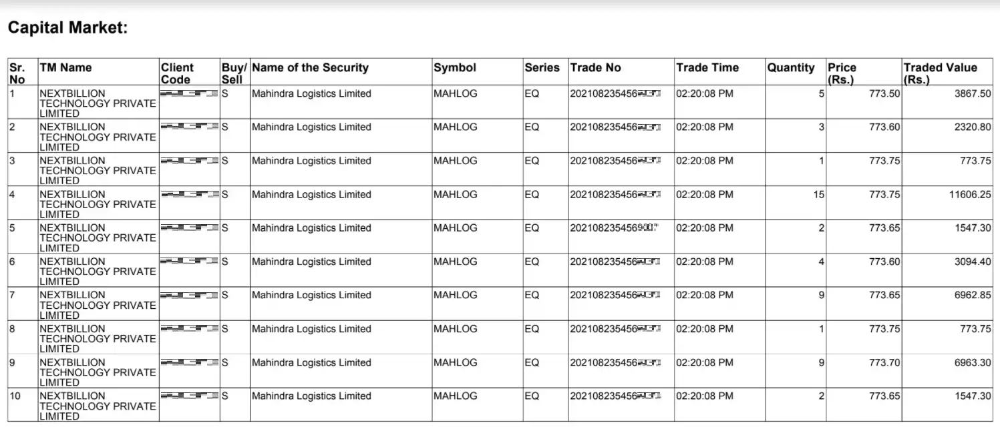

# NSE Trades Verification Pdf Parser


A pdf parser which parses nse-trades-verification email attachment pdf.

## Overview

People who invest/trades in Indian Stock market receives an email from NSE or BSE for verification of the buy/sell of shares by their brokers. The NSE email is generated  from email id: `nse-direct [at] nse [dot] co [dot] in` with subject line as `Trades executed at NSE`. The body of email looks as follows:

```
Dear Investor,

With reference to SEBI circular ref no. CIR/MIRSD/15/2011dated August 02, 2011, a SMS and email facility has been provided for ease and convenience of verification of trades.

Information pertaining to your transactions (Traded value is quantity traded multiplied by trade price) for   25-SEP-2020   is attached below. Please follow the procedure given below for opening the attachment:

1. Click on the attachment provided with this mail
2. You will be prompted for your password.
3. The password is your PAN number in upper case.
4. Please check the first 3 letters of PAN provided in the mail attachment, to avoid mistakes

...
```
  
Usually this email is generated after one day of actual trade with all the details in a pdf attachment which looks like:

(Note: Data has been blurred intentionally.)



This code attempts to extract these trade related details from the pdf attachment.

## Usage

Following code can be directly used to parse the pdf. Provide path to the original pdf from email and pan-no which is the password to the pdf.

```java
NseTradesParser nseTradesParser = new NseTradesParser(new File("src/main/resources/trades.pdf"),"pan-no");
List<Trade> trades = nseTradesParser.getTrades();
String json = nseTradesParser.getTradesJson();
```

It provides two methods to fetch the extracted data, one which gives a List of Trades and other which gives a JSON of the trades in following format:

```json
[
	{
		"srNo": 1,
		"tmName": "ICICI SECURITIES LIMITED",
		"clientCode": 1000000000,
		"buySell": "B",
		"nameOfSecurity": "Ashok Leyland Limited",
		"symbol": "ASHOKLEY",
		"series": "EQ",
		"tradeNo": 202111110190000,
		"tradeTime": "11:52:27 AM",
		"quantity": 29,
		"price": 147.1,
		"tradedValue": 4265.9
	}
]
```
This code is compiled and tested using JDK 17.

## License

Nse Trades Verification PDF Parser is provided under [MIT License](./LICENSE).

It uses following dependencies which have their own license agreements:
- pdfbox-3.0.0-RC1
- gson-2.9.0
- junit-4.13.2
